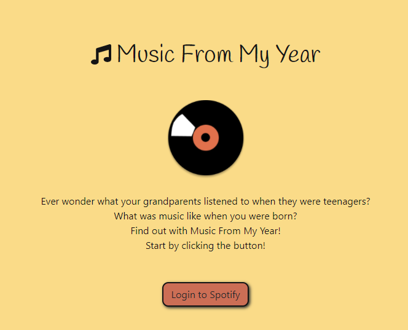
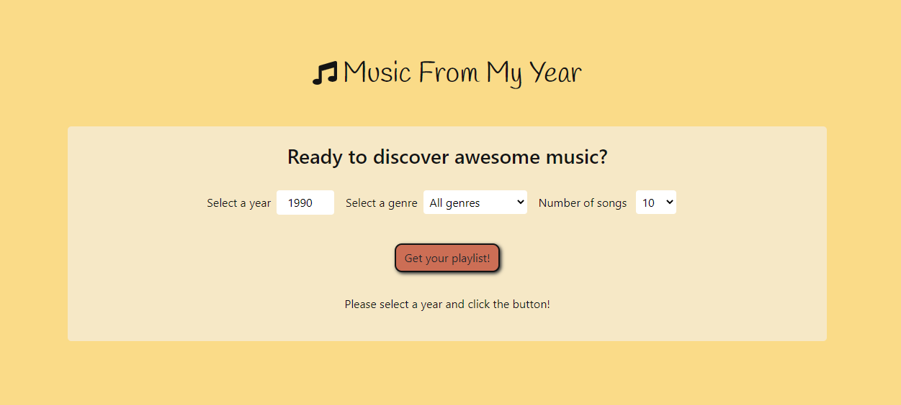
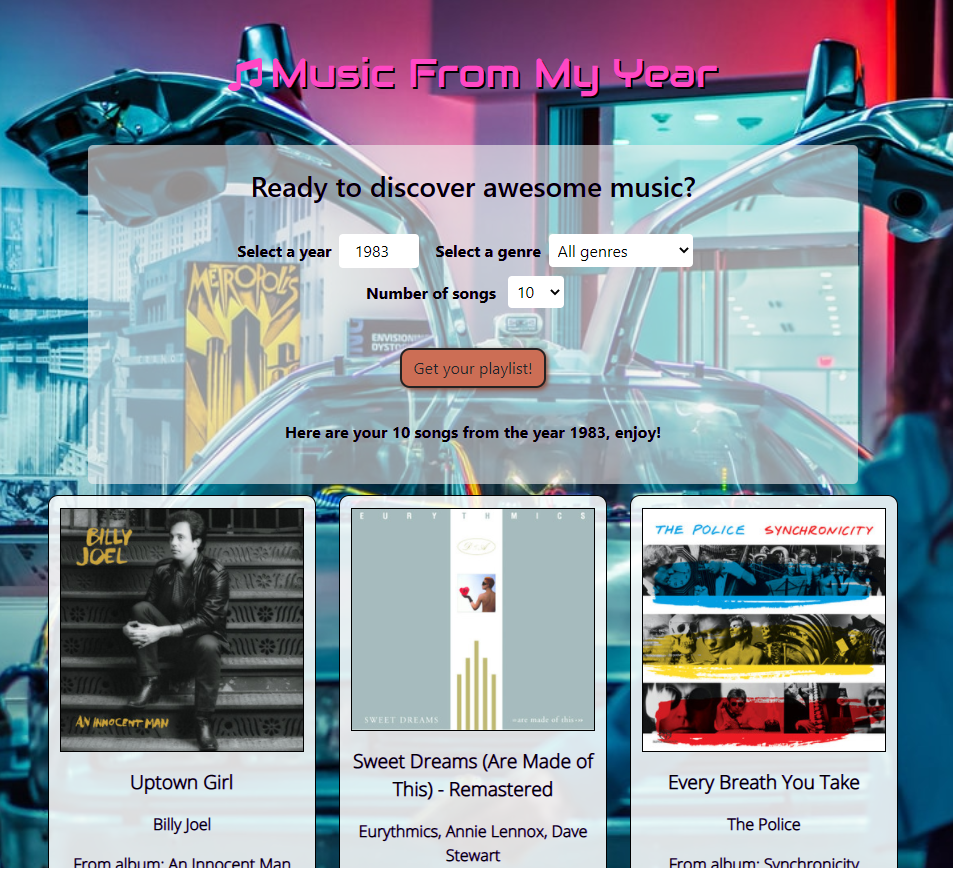
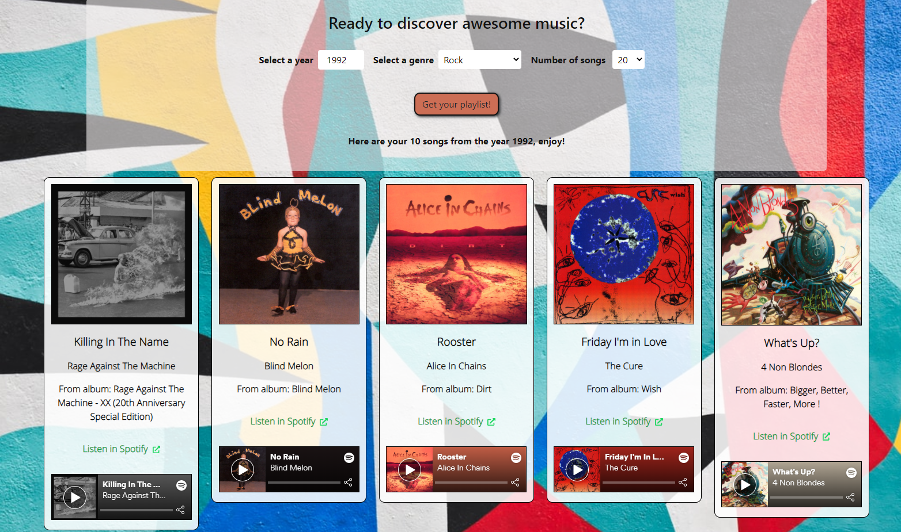

Summer Project 2020, Helsinki Business College. End of first 5-month semester.

Music From My Year is a React App that uses Spotify API. The user can select the year, genre and the amount of results they want to get. Background image and title font change with each decade.

Time spent on project: 3,5 weeks.

Team members: Elisabet Laitinen (https://github.com/ellu-laitinen), Laura Pohjanpalo (https://github.com/lapohjan), Katariina Vuorinen ( https://github.com/kata-v).

